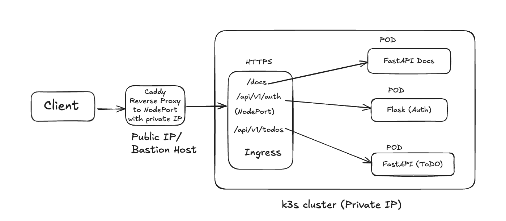

# Microservice Deployment Using Docker, Caddy, K3s, and Ingress Controller

This guide provides step-by-step instructions for setting up an SSL certificate with Caddy, containerizing FastAPI and Flask applications using Docker, and configuring K3s clusters with an Ingress Controller for path-based routing.



## Prerequisites

Before starting, ensure the following are available:

- Registered Domain
- Two virtual machines, one configured with a public IP address and the other with a private IP address.
- K3S Clusters ([K3S Installation Guide](https://k3s.io/))
- Caddy ([Caddy Installation Guide](https://caddyserver.com/))
- Docker ([Docker Installation Guide](https://www.docker.com/))
- FastAPI App and Flask App

## Step-by-Step Guide

### 1. SSH to Public IP VM and Configure Docker for Caddy

1. **Install Docker and Docker Compose**:

   Docker and Docker Compose will be used to run the Caddy container. Install them using the following commands:

   ```bash
   sudo apt update
   sudo apt upgrade -y

   sudo apt install -y apt-transport-https ca-certificates curl software-properties-common

   curl -fsSL https://download.docker.com/linux/ubuntu/gpg | sudo gpg --dearmor -o /usr/share/keyrings/docker-archive-keyring.gpg

   echo "deb [arch=$(dpkg --print-architecture) signed-by=/usr/share/keyrings/docker-archive-keyring.gpg] https://download.docker.com/linux/ubuntu $(lsb_release -cs) stable" | sudo tee /etc/apt/sources.list.d/docker.list > /dev/null

   sudo apt update
   sudo apt install -y docker-ce docker-ce-cli containerd.io

   sudo curl -L "https://github.com/docker/compose/releases/download/$(curl -s https://api.github.com/repos/docker/compose/releases/latest | grep -oP '"tag_name": "\K(.*)(?=")')/docker-compose-$(uname -s)-$(uname -m)" -o /usr/local/bin/docker-compose

   sudo chmod +x /usr/local/bin/docker-compose

   sudo groupadd docker
   sudo usermod -aG docker $USER
   newgrp docker

   sudo systemctl enable docker
   ```

2. **Configure Caddy and Docker Compose**:

   - Create a directory named `caddy` and navigate into it:
     ```bash
     mkdir caddy
     cd caddy
     ```

   - Inside the `caddy` directory, create a subdirectory `caddy-config` and the necessary configuration files.

   - **Caddyfile**: Add the following configuration:

     ```
     {
       email arafin2021@gmail.com
     }

     arafinahmed.com {
         reverse_proxy https://private_ip_of_k3s:NodePort {
             transport http {
                 tls
                 tls_insecure_skip_verify
             }
             header_up Host {host}
             header_up X-Forwarded-For {remote_host}
             header_up X-Real-IP {remote_host}
             header_up X-Forwarded-Proto {scheme}
         }
     }
     ```

     Replace `arafinahmed.com` with your domain name and update `private_ip_of_k3s` and `NodePort` accordingly.

   - **docker-compose.yaml**: Add the following configuration:

     ```yaml
     version: '3'
     services:
       caddy:
         image: caddy:latest
         container_name: caddy
         ports:
           - "80:80"
           - "443:443"
         volumes:
           - ./caddy-config/Caddyfile:/etc/caddy/Caddyfile:ro
           - ./caddy-config/caddy_data:/data
         networks:
           - app_network
         restart: unless-stopped

     networks:
       app_network:
         external: true
     ```

   - Run the following command to start the Caddy container:
     ```bash
     docker-compose up -d
     ```

     This starts the Caddy server with SSL certificate management.

### 2. Manage K3S Clusters

1. SSH to the Caddy server as a bastion host, then SSH into the K3s cluster VM.

2. Create four YAML files: `ingress.yaml`, `todo-deployment.yaml`, `auth-deployment.yaml`, and `nginx-deployment.yaml`. Add the following configurations:

   - **`ingress.yaml`**:

     ```yaml
     apiVersion: networking.k8s.io/v1
     kind: Ingress
     metadata:
       name: ingress-service
       annotations:
         kubernetes.io/ingress.class: nginx
         nginx.ingress.kubernetes.io/use-regex: 'true'
     spec:
       rules:
         - host: arafinahmed.com
           http:
             paths:
               - path: /api/v1/hello
                 pathType: Prefix
                 backend:
                   service:
                     name: nginx-service
                     port:
                       number: 80
               - path: /docs/?(.*)
                 pathType: Prefix
                 backend:
                   service:
                     name: fastapi-app
                     port:
                       number: 8000
               - path: /api/v1/auth
                 pathType: Prefix
                 backend:
                   service:
                     name: flask-app
                     port:
                       number: 5000
               - path: /api/v1/todos
                 pathType: Prefix
                 backend:
                   service:
                     name: fastapi-app
                     port:
                       number: 8000
               - path: /
                 pathType: Prefix
                 backend:
                   service:
                     name: nginx-service
                     port:
                       number: 80
     ```

   - Add the respective configurations for `todo-deployment.yaml`, `auth-deployment.yaml`, and `nginx-deployment.yaml` as provided in repos k8s folder.

3. Apply the configurations using the following commands:
   ```bash
   kubectl apply -f <file_name.yaml>
   ```

4. Install the Ingress NGINX controller using:
   ```bash
   kubectl apply -f https://raw.githubusercontent.com/kubernetes/ingress-nginx/controller-v1.3.0/deploy/static/provider/cloud/deploy.yaml
   ```

5. Update the NodePort details in the Caddyfile to match your K3s setup.

6. Restart the Caddy container to apply the changes:
   ```bash
   docker-compose up -d
   ```
7. Ensure that you update your domain's A record to point to the public IP address of your Caddy server.

### Conclusion

Your microservices are now deployed with SSL security and path-based routing. You can access your services via the configured domain.
